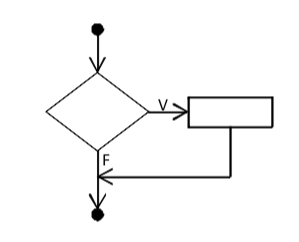
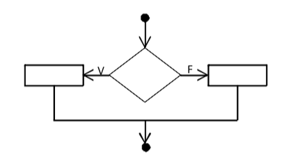
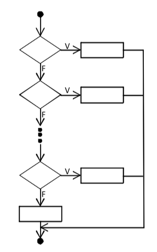
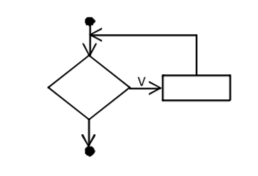
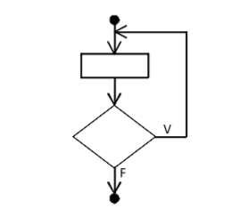
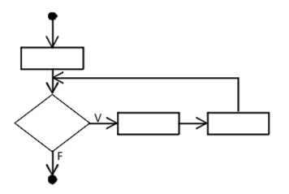

# Introducción a la programación con Java
# Indice
1. [Prólogo](#prologo)
2. [Introducción](#introduccion)
    - [JRE](#jre)
        - [JVM](#jvm)
    - [JDK](#jdk)
3. [Variables](#variables)
    - [Constantes](#constantes)
    - [Asignación](#asignacion)
4. [Estructuras de control](#control)
    - [Condicionales](#condicionales)
        - [If/else](#if)
        - [Switch](#switch)
10. [Objetos](#objetos)

# <a name="prologo"></a>Prólogo
Retomo en mi vida la parte de enseñar, sé lo complicado que es encontrar cursos en el idioma español y sobre todo que estén al alcance de uno (ya sea distancia, precio y tiempo).

Al lenguaje **Java** le tengo mucho cariño ya que me abrio muchas puertas laboralmente, fue la primera certificación que obtuve en mi vida y ha sido la que me dió pie a querer saber más de diferentes cosas.

Espero que con esto pueda ayudar a más personas a aprender y sobre todo poder transmitirles mi sed de conocimiento.

---

# <a name="introduccion"></a>Introducción
Hoy en día utilizamos diferentes programas en la vida diaria, ya sea en nuestra computadora personal (o laboral) o teléfono inteligente. Aplicaciones para escribir, contar, llevar un registro, interacción social, ver video, juegos, etc. Entonces, si ya usamos tantos programas en el día a día, ¿por qué no crear uno propio?.

Para dar respuesta a esa pregunta, es muy simple. Hay que aprender a programar, para ello en este curso de introducción a la programación basado en *Java* iniciaremos este hito en la vida de los que desean aprender para lograr crear una aplicación propia.

> *Java* es un lenguaje de alto nivel, esto quiere decir que su escritura es "sencilla" para el ser humano, lo que permite una máxima flexibilidad al programador al momento de escribirlo y leerlo. Así como una programación orientado a objetos.

---

#### <a name="jre"></a>JRE

**J**ava **R**untime **E**nvironment, en español significa Entorno de Ejecución de Java. El JRE actúa como un «intermediario» entre el sistema y Java.

Este ambiente de ejecución para aplicaciones Java (JRE) está compuesto por dos importantes áreas, la primera son las clases que conforman el API de java y la segunda es la JVM.

- El API son todas las clases que componen el ambiente Java y que al momento de ser utilizadas desde la aplicación podrán ser ejecutadas y/o interpretadas por la JVM.
- La JVM es un componente de software que actúa justamente como una máquina virtual o un espacio virtual de memoria donde se ejecutan las aplicaciones Java.

---

###### <a name="jvm"></a>JVM

**J**ava **V**irtual **M**achine o máquina virtual Java ejecuta instrucciones generadas por un compilador Java, es decir interpreta el código bytecode *(lo que "compilamos" con javac)* y un entorno de ejecución que permite ejecutar estos archivos de clase Java en *"cualquier"* plataforma, no importando el origen dónde fueron desarrollados originalmente.

Cuando se *"compila"* el código del lenguaje Java no lo hace a un lenguaje máquina, sino a un intermedio denominado **bytecode** y este es el que ejecuta nuestra máquina virtual de Java. La premisa es que el código se pueda ejecutar en cualquier sistema operativo, pero esto es relativo siempre y cuando no usemos instrucciones nativas del SO o particularidades especiales de la máquina virtual.

El eslogan es *"Escribe una vez, ejecuta en todas partes"* *("Write once, write everywhere")*

---

#### <a name="jdk"></a>JDK

**J**ava **D**evelopment **K**it, en español sería Herramienta de Desarrollo Java, aquí encontramos herramientas como *javac* que es el que nos permite poder *"compilar"* nuestros archivos *".java"* *(código fuente)*, en archivos *".class"* *(bytecode)* y estos son los archivos que puede interpretar la *JVM* y ejecutará nuestros programas en *"cualquier"* máquina que tenga *JRE*

Algunas de los comandos disponibles al instalar el *JDK*, son:

- jar: crear y gestionar **JAR** (Java Archive files) - *(Java archive tool)*
- java: ejecutar aplicaciones *Java* - *(Java application launcher)*
- javac: compilador de *Java* - *(Java compiler)*
- javadoc: Generador de documentación *API* - *(Java API documentation generator)*
- javah: generador de header y stubs C, ayuda a crear métodos nativos - *(C header and stub file generator)*
- javap: decompilador de *bytecode* (archivos *.class*) - *(Java class file disassembler)*
- jcmd: diagnóstico de la *JVM*
- jconsole: monitorización de la *JVM* por medio de *JMS* ya sean remotas o locales - *(J2SE Monitoring and Management Console)*
- jdb: *Java Debugger*
- jps:Lista las *JVM's* de un sistema - *(Java Virtual Machine Process Status Tool)*
- jstat: recolecta y muestra estádisticas de rendimiento - *(Java Virtual Machine statistics monitoring tool)*
- jhat: Convierte archivos *heap dump* en servidores web para poder navegar sobre este - *(Java Heap Analysis Tool)*
- jmap: mapas de memoria de un proceso - *(memory map)*
- jstack: Muestra un stack trace de hilos de un proceso - *(stack trace)*
- jjs: shell de Nashorn

[Referencia](https://www.java.com/es/download/faq/techinfo.xml)

---

#### <a name="variables"></a>Variables
Las variables son reservaciones en memoria que se hacen asignando primero el tipo de esta y después el nombre que tendrá. Y en esta variable un programa podrá almacenar algun dato para después ser utilizada dentro del mismo programa.

En *Java* las variables pueden ser datos primitivos u objetos.

##### <a name="declaracion"></a>Declaración de Variables
Para declarar una variable la estructura es la siguiente:

> *tipo_de_dato nombre_de_la_variable*

Ejemplo:
```java
int edad;
```

Y para declarar varias variables del mismo tipo la estructura es la siguiente:

> *tipo_de_dato nombre_de_la_variable_1,nombre_de_la_variable_2,nombre_de_la_variable_3*

Ejemplo:
```java
int a,b,c,edad;
```

> Restricciones:
> - No puede usarse una palabra reservada para el nombre de una variables

###### <a name="constantes"></a>Constantes
Una constante es una variable que su valor no puede ser modificado. Para definir una constante en *Java* se requiere utilizar la palabra reservada *final* antes de la declaración de la variable y el nombre de la variable se pone en mayúsculas (esto es por convención y tener un código más limpio), la estructura es la siguiente:

> *final tipo_de_dato NOMBRE_VARIABLE;*

Ejemplo:
```java
final int IVA=16;
```
---

##### <a name="asignacion"></a>Asignación
Una vez que la variable es declarada se puede asignar un dato/valor con la siguiente estructura:

> *nombre_variable=expresion_o_valor*

Ejemplo:
```java
int edad, a, b, c, resultado; // se declaran las variables
edad=30;
a=10;
b=3;
c=a+b;
resultado=edad-10;
```
Otra manera es asignar un valor inicial a una variable en el mismo momento que es declarada, eso se hace de la siguiente manera:
```java
int edad=30; // se declara la variable edad de tipo int y se inicializa con el valor 30
int a, b=20; // se declara la variable a y b, pero b es inicializada con el valor 20;
```

La asignación se hace por medio del signo de **"="**, debe entenderse que esto no representa comparativa de igualdad, sino asignación directa. Sin embargo existen otros operadores de asignación.

| Operador | Descripción                                                                                                              | Ejemplo                                                                                   |
|----------|--------------------------------------------------------------------------------------------------------------------------|-------------------------------------------------------------------------------------------|
| =        | Asigna una expresión o valor de derecha a izquierda del operador.                                                        | int a=9; // esto es una asignación directa                                                |
| +=       | Suma la expresión de la derecha, a la variable que se encuentra al izquierda del operador.                               | int a=3; a+=5; // esto le da el valor de 8 a la variable a, que sería igual a poner a=a+5 |
| -=       | Resta la expresión de la derecha, a la variable que se encuentra al izquierda del operador.                              |                          int a=10; a-=5; // esto le da el valor de 5 a la variable a, que sería igual a poner a=a-5                                                                 |
| *=       | Multiplica la expresión de la derecha, a la variable que se encuentra al izquierda del operador.                         |     int a=3; a*=5; // esto le da el valor de 15 a la variable a, que sería igual a poner a=a*5                                                                                      |
| /=       | Divide la expresión de la derecha, a la variable que se encuentra al izquierda del operador.                             |             int a=10; a/=2; // esto le da el valor de 5 a la variable a, que sería igual a poner a=a/2                                                                              |
| %=       | Calcula el resto de la división de la expresión de la derecha, a la variable que se encuentra al izquierda del operador. |int a=10; a%=2; // esto le da el valor de 0 a la variable a, que sería igual a poner a=a%5                                                                                           |

---

#### <a name="control"></a>Estructuras de control

Las estructuras de control son bloques de contrucción básicos de cualquier programa. Y estas estructuras de control podriamos dividirlas en dos: condicionales y repetitivas.

##### <a name="condicionales"></a>Condicionales

Esta estrutctura de control condicional o selectiva, nos permite decidir que ejecutar y qué no en un programa, dependiendo del resultado de una **operación booleana**. Esto quiere decir:

###### <a name="if"></a>IF-ELSE

- Si hacemos una condicional simple
```
A es igual 4
B es igual 6
Si (A es menor qué B) Entonces:
    // hará las acciones que estén aquí cuando se cumpla la condición booleana y resulte en verdadera (TRUE)
    Mostrar ("A es menor que B")
```



- Si hacemos una condicional doble

```
A es igual 4
B es igual 6
Si (A es menor qué B) Entonces:
    // hará las acciones que estén aquí cuando se cumpla la condición booleana y resulte en verdadera (TRUE)
    Mostrar ("A es menor que B")
Sino entonces:
    // hará las acciones que estén aquí, cuando la condición booleana resulto en falsa (FALSE)
    Mostrar ("A no es menor que B")
```



Y en *Java* sería así la sintaxis para la condición simple:

```java
int a = 4;
int b = 6;
// la estructura es: if(condición booleana) {
//  bloque de instrucciones a realizar si se cumplio la condición
// ....
// }
if(a < b){
    System.out.println("A es menor que B");
}
```

Y en *Java* sería así la sintaxis para la condición doble:

```java
int a = 4;
int b = 6;
// la estructura es: if(condición booleana) {
//  bloque de instrucciones a realizar si se cumplio la condición
// ....
// } else {
//  bloque de instrucciones a realizar si NO se cumplio la condición
// }
//
if(a < b){
    System.out.println("A es menor que B");
}else{
    System.out.println("A no es menor que B");
}
```

###### <a name="switch"></a>Switch

```
A es igual a 2
Conmutador (A)
    Caso 1:
        Mostrar ("Entraste al caso 1")
    Case 2:
        Mostrar ("Entraste al caso 2")
    Caso 3:
        Mostrar ("Entraste al caso 3")
    Caso 4:
        Mostrar ("Entraste al caso 4")
    Caso predefinido:
        Mostrar ("Entraste al caso predefinido")
```



Y en *Java* sería así la sintaxis de la selección multiple:

```java
int a = 2;
// la estructura es: switch(condición booleana) {
//  caso 1..:
//  caso ..N:
//  default ...:
// }
switch(a){
    case 1:
        System.out.println("Entraste al caso 1");
        break;
    case 2:
        System.out.println("Entraste al caso 2");
        break;
    case 3:
        System.out.println("Entraste al caso 3");
        break;
    case 4:
        System.out.println("Entraste al caso 4");
        break;
    default:
        System.out.println("Entraste al caso predefinido");
        break;
}
```

##### <a name="bucles"></a>Ciclos o blucles

Estas estructuras repiten un bloque de instrucciones mientras que el resultado de la operación booleana sea verdadera (TRUE).

Esto quiere decir:

##### <a name="while"></a>While

```
A es igual a 1
Mientras (A es menor que 100) Entonces:
    // se ejecutará las instrucciones N veces siempre y cuando cumpla la condición
    A = A + 1
```



Y en *Java* sería así la sintaxis del bucle mientras:

```java
int a = 1;
// la estructura es: while(condición booleana) {
//  intrucciones que se repetiran N veces siempre que se cumpla la condición
// }
while (a<100){
    a = a + 1;
}
```

##### <a name="do"></a>Do-While

Esta condición se ejecutará por lo menos ***UNA* vez y después iniciará el ciclo siempre que se cumpla la condición booleana:

```
A es igual a 1
Hacer
    // se ejecutará las instrucciones por lo menos UNA vez y si cumple la condición se ejecutará N veces hasta que el resultado sea falso en la operación booleana
    A = A + 1
Mientras (A es menor que 100) Entonces:

```



Y en *Java* sería así la sintaxis del bucle hacer mientras:

```java
int a = 1;
// la estructura es:  do {
//  intrucciones que se ejecutará por lo menos UNA vez y se repetiran N veces siempre que se cumpla la condición.
// }while(condición booleana);
do{
    a = a + 1;
}
while (a<100);
```

##### <a name="for"></a>For

Este ciclo o bucle se ejecutara **HASTA** que no se cumpla más la condición:

```
A es igual a 1
Para (Inicia i es igual a 0; Hasta que i es menos o igual a 100; aumentamos i más 1)
    // las intrucciones se realizaran N veces hasta que se cumpla la condición booleana
    A = A + 1
```



Y en *Java* sería así la sintaxis del Para hasta:

```java
int a = 1;
// la estructura es:  for ([INICIALIZACIÓN] ; [OPERACION BOOLEANA] ; [INCREMENTO O DECREMENTO]){
//  Las instrucciones aquí se ejecutarán hasta que no se cumpla más la condición
// }
for(int i = 1; i <= 100 ; i = i +1){
    a = a + 1;
}

// si queremos hacer un for infinito sería así:

for(;  ; ){
    System.out.println("La sumando a: " + a++);
}
```

---

#### <a name="camel"></a>Camel case
Camel case se utiliza para dar una estructura al texto que se escribe en frases o palabras compuestas, por ejemplo:

> *usuarioNuevo*

El nombre de este estilo de escritura es debido a la asemejanza de las jorobas de un camello, en las cuales se usa minúsculas y mayúsculas al escribir.

> La notación Upper Camel Case: iniciamos con una mayúscula continuamos con minúsculas hasta llegar a la siguiente palabra y esta iniciara con mayúscula continuando con minúscula.

Por ejemplo:
```java
// Esto es una clase
public class AutoCompacto{}
```

> La notación Lower Camel Case: iniciamos con una minúsculas y hasta la siguiente palabra comenzará con una mayúscula continuando con minúsculas.

Por ejemplo:
```java
// para un método
public Double obtenerIva(Double monto){}

// variable
int edadUsuario;
```

> Esto es un estandar o conjunto de convenciones que permiten leer el código con mayor facilidad al ser humano, para poder saber si es una clase, una variable, una constante o método.

---

#### <a name="reservadas"></a>Palabras reservadas

| reservada | reservada | reservada  | reservada | reservada    |
|-----------|-----------|------------|-----------|--------------|
| abstract  | continue  | for        | new       | switch       |
| assert    | default   | goto       | package   | synchronized |
| boolean   | do        | if         | private   | this         |
| break     | double    | implements | protected | throw        |
| byte      | else      | import     | public    | thorws       |
| case      | enum      | instanceof | return    | transient    |
| catch     | extends   | int        | short     | try          |
| char      | final     | interface  | static    | void         |
| class     | finally   | long       | strictfp  | volatile     |
| const     | float     | native     | super     | while        |
| null      | false     | true       |           |              |

---

#### <a name="modificadores"></a>Modificadores de acceso
En *Java* existen 4 tipos:
- public
- private
- protected
- default (por defecto)

Sino escribimos ningún modificador este toma el nivel de acceso *default*
Ejemplo:
```java
// en una clase sería así
class MiClase{

    // en un atributo de clase
    int valor;

    // en un método
    void miMetodo(){}
}
```

Ahora si deseamos usar los modificadores son de la siguiente forma:
```java
// en una clase sería así
public class OtraClase{

    // en un atributo de clase
    private int valor;

    // en un método
    public int getValor(){
        return this.valor;
    }

    protected void miMetodo(){

    }
}
```

Los modificadores de acceso deben ser escritos antes de la declaración, como se muestra en los ejemplos de arriba. Pero no se pone modificador de acceso a las variables que están dentro de un método, porque su visibilidad o tiempo de vida lo determina el *scope* del método.

Ejemplo:
```java
public class NuevaClase{

    private int valor;

    public int getValor(){
        return this.valor;
    }

    protected void miMetodo(){
        // aquí no se pone el modificador de acceso
        int variableA = 0;
    }
}
```

La visibilidad de los modificadores de acceso es la siguiente:

| Modificador/Visibilidad | En la misma clase | Otra clase del mismo paquete | Subclases de otro paquete | Otra clase de otro paquete |
|-------------------------|-------------------|------------------------------|---------------------------|----------------------------|
| public                  | X                 | X                            | X                         | X                          |
| protected               | X                 | X                            | X                         |                            |
| default                 | X                 | X                            |                           |                            |
| private                 | X                 |                              |                           |                            |

##### <a name="static"></a>Static

Static es un *"modificador de acceso"* que si traducimos literalmente nos daría "estatico", sin embargo no se refiere a un valor que es constante sino a la visibilidad de este fuera de la clase, así que son accesibles desde el nombre de la clase sin necesidad de intanciar. Así que esto implica que no será necesario crear un objeto para acceder a estos atributos y/o métodos.

Ejemplo:

```java
class OtraClase {
    static int numeroDeSaludos = 0;

    static void saludar(){
        System.out.println("Hola!!");
        numeroDeSaludos++;
    }
}

class Ejemplo {

    public static void main(String[] args){
        OtraClase.saludar();
        OtraClase.saludar();

        // el resultado será dos
        System.out.println("Número de saludos: " + OtraClase.numeroDeSaludos);
    }
}
```


---

#### <a name="primitivos"></a>Datos primitivos
En Java solo existen 8 tipos de datos primitivos, que se clasifican de la siguiente manera:

- Números enteros (byte, short, int, long).
- Números reales (float, double).
- Carácter (char).
- Booleano o lógico (boolean), valores true o false.

| Tipo    | Tamaño  | Valor mínimo          | Valor máximo         |
|---------|---------|-----------------------|----------------------|
| byte    | 8 bits  | -128                  | 127                  |
| short   | 16 bits | -32768                | 32767                |
| int     | 32 bits | -2147483648           | 2147483647           |
| long    | 64 bits | -9223372036854775808  | 9223372036854775807  |
| float   | 32 bits | -3.402823e38          | 3.402823e38          |
| double  | 64 bits | -1.79769313486232e308 | 1.79769313486232e308 |
| char    | 16 bits | '\u0000'              | '\uffff'             |
| boolean | -       |                       |                      |

En los datos primitivos no existe alguno en el cual pueda representar una cadena de caracteres para ello se debe usar un objeto llamado *String*

---

#### <a name="logicos"></a>Operadores lógicos

| OPERADOR     | DESCRIPCIÓN                                |
|--------------|--------------------------------------------|
| ==           | Es igual                                   |
| !=           | Es distinto                                |
| <, <=, >, >= | Menor, menor o igual, mayor, mayor o igual |
| &&           | Operador and (Y)                           |
| \|\| | Operador or (O) |
| !            | Operador not (NO)                          |

---

### <a name="aritmeticos"></a>Operadores aritméticos

| OPERADOR | DESCRIPCIÓN                                                                          |
|----------|--------------------------------------------------------------------------------------|
| +        | Suma                                                                                 |
| -        | Resta                                                                                |
| *        | Multiplicación                                                                       |
| /        | División                                                                             |
| %        | Mod, es el resto de una división entre enteros                                       |
| ++       | Incrementa la variable en una unidad y la deposita el resultado en la misma variable |
| - -       | Decrementa la variable en una unidad y la deposita el resultado en la misma variable |

---

### <a name="poo"></a>Programación orientada a objetos o POO

Como se mencionó en la introducción de este documento, el lenguaje *Java* es orientado a objetos, por lo que podremos aplicar lo que dice este paradigma entre estas características y beneficios son: *herencia, cohesión, abstracción, polimorfismo, acoplamiento y encapsulamiento*.

En la vida real todos los objetos tienen una serie de características y un comportamiento. Así que un objeto contiene:

- Campos o atributos: componentes de un objeto que almacenan datos, por ejemplo tamaño, edad, sexo, altura, nacionalidad, ancho, color, dimensión, etc...
- Rutinas o métodos: son el comportamiento de un objeto que lleva a cabo una determinada acción o tarea con los atributos, por ejemplo calcular edad, calcular la hipotenusa, calcular diametro, calcular área, abrir, cerrar, acelerar, etc...

### <a name="clases"></a>Clases

Las clases contienen la definición de los objetos, se puede decir que son *"plantillas"* para la creación de objetos. Entonces podemos decir que la clase persona sería la *plantilla* de cada ser humano y está contendría la definición de un ser humano, y cada ser humano sería una *instancia* u *objeto* de la clase persona.

La estructura de una clase es:

```java
[modificadores] class IdentificadorDeClase {
    // Declaraciones de atributos y metodos
    ...
}
```

Entonces una clase  en sintaxis de *Java* es utilizando la palabra reservada *class* después el nombre/identificador de la clase *(respetando el upper camel case)* continuando con apertura y cierre de llaves ({,}), así:

```java
// aquí el modificador de acceso es default
class MiPrimeraClase {
    // atributos de clase

    // métodos de clase
}
```

Como se muestra anteriormente se define una clase en la sintaxis de *Java*, pero para que está funcione correctamente debe contar con atributos y métodos, por ejemplo:

```java
class Persona {
    // estos son atributos de clase
    Date fechaNacimiento;
    Boolean estaVivo;
    Float altura;
    Float peso;
    Character sexo;

    // estos son métodos de clase
    void correr(){
        // aquí las instrucciones que lo harán correr
    }

    void nadar(){
        // aquí las instrucciones que lo harán nadar
    }

}
```

Sin embargo podemos enriquecer la definición de nuestra clase especificando explícitamente uno de los modificadores de acceso de la siguiente manera:

```java
// el modificador de acceso es [public] pero puede ser private y protected
public class MiPrimeraClaseConModificadorDeAcceso {
    // atributos de clase

    // métodos de clase
}
```

Ahora haciendo uso de lo mostrado anteriormente sería así:

```java
public class Persona {
    // estos son atributos de clase
    private Date fechaNacimiento;
    private Boolean estaVivo;
    private Float altura;
    private Float peso;
    private Character sexo;

    // estos son métodos de clase
    public void correr(){
        // aquí las instrucciones que lo harán correr
    }

    public void nadar(){
        // aquí las instrucciones que lo harán nadar
    }

    // método getter del atributo altura
    public Float getAltura(){
        return altura;
    }

    // método setter del atributo altura
    public void setAltura(Float altura){
        this.altura = altura;
    }

}
```

#### <a name="constructores"></a>Constructores

Los constructores se ejecutan en el momento en que se crea un instancia de la clase, o sea cuando usamos la palabra reservada *new*. Cuando en una clase no especificamos ningún tipo de constructor, el compilador añade uno predeterminado público por omisión sin parámetros, el cual no hace nada mas que crear el objeto e inicializar los atributos de acuerdo al tipo de datos, sin embargo en el momento que definimos un constructor desaparece el constructor predeterminado (default).

Un constructor tiene las siguientes características:
- Tiene exactamente el mismo nombre que la clases
- No retorna ningún valor
- El constructor puede usar todos los modificades de acceso

La sintaxis del constructor sería la siguiente:


```java
public class MiClase {

    private int atributo1;
    private String atributo2;

    // [modificador_de_acceso] MiClase([parametros]){
    //      intrucciones a realizar al momento de construir el objeto
    // }
    public MiClase(int atributo1,String atributo2){
        this.atributo1 = atributo1;
        this.atributo2 = atributo2;
    }
}


```

Y ya usandolo sería así:

```java
public class MiClase {

    private int atributo1;
    private String atributo2;

    // al crear este constructor desaparece el constructor predeterminado (default)
    public MiClase(int atributo1,String atributo2){
        this.atributo1 = atributo1;
        this.atributo2 = atributo2;
    }
}

public class Principal {

    public static void main(String[] args){


        MiClase miObjetoDeClase; // Declaramos
        miObjetoDeClase = new MiClase(4,"hola"); // Inicializamos, aquí usamos el constructor definido por nosotros

        miObjetoDeClase = new MiClase(); // Esto daría un error porqué ese constructor desaparecío en el momento que creamos nuestro constructor

    }
}
```

Para tener el constructor predeterminado y otros constructores sería de la siguiente forma:

```java
public class MiClase {

    private int atributo1;
    private String atributo2;

    // este es el constructor predeterminado
    public MiClase(){
    }

    public MiClase(int atributo1,String atributo2){
        this.atributo1 = atributo1;
        this.atributo2 = atributo2;
    }
}

public class Principal {

    public static void main(String[] args){


        MiClase miObjetoDeClase; // Declaramos
        miObjetoDeClase = new MiClase(4,"hola"); // Inicializamos, aquí usamos el constructor definido por nosotros

        miObjetoDeClase = new MiClase(); // Ahora si podemos hacer esto

    }
}
```


#### <a name="metodos"></a>Métodos

Los métodos le definen el comportamiento a los objetos de la clase, estos métodos pueden hacer uso o no de los atributos de la clase, así como crear variables dentro del método para realizar su cometido. La estructura de un método en *Java* es la siguiente:

```java
public class IdentificadorClase {

    private int atributo1;

    // estructura de método
    // [modificador] [tipo_de_retorno] [nombre/identificador_método] ([parametros]){
    //    [retorno]
    // }
    public int metodo1(int parametro1,String parametro2){
        int variableDeMetodo = atributo1 + parametro1;
        return variableDeMetodo;
    }

}
```

El tipo de retorno puede ser cualquier objeto de *Java*, y solamente cuando el tipo de retorno usemos la palabra reservada *void* (retorno vácio) no séra necesario usar la palabra reservada *return*, así:

```java
public class IdentificadorClase {

    private int atributo1;
    private String atributo2;

    public void metodo1(int parametro1,String parametro2){
        int variableDeMetodo = atributo1 + parametro1;
        atributo1 = variableDeMetodo;
        atributo2 = parametro2;
    }

}
```

###### <a name="main"></a>Método principal o main

Este método nos permite iniciar nuestra aplicación *Java*, siendo el punto de entrada y su estructura es la siguiente:

```java
    public static void main(String[] args){
        // aquí las instrucciones que deseamos ejecutar
    }
```

---

### <a name="objetos"></a>Objetos

El objeto es la representación en memoria de la clase, esto lo hace *"tangible"* para su manipulación. Todos los objetos empleados en un programa han de pertenecer a una clase determinada. Así que un objeto es una *instancia* de una clase determinada referenciada por una variable que almacena su dirección en memoria. Cuando decimos que en *Java* no hay punteros realmente a lo que nos referimos es que el programador no los puede ver y manipular a voluntad.

Ejemplo de crear una instancia de una clase que creamos.

```java
public class Persona {
    private Integer edad;
    private String nombre;

    public Integer getEdad(){
        return edad;
    }

    public void setEdad(Integer edad){
        this.edad = edad;
    }

    public String getNombre(){
        return nombre;
    }

    public void setNombre(String nombre){
        this.nombre = nombre;
    }
}

public class MiPrincipal {

    public static void main(String[] args){
        Persona objetoPersona; // Declaramos una variable con el nombre objetoPersona de tipo Persona que es una clase
        objetoPersona = new Persona(); // Aquí hemos inicializado el objeto de la clase Persona;

        objetoPersona.setEdad(30);
        objetoPersona.setNombre("Jose Jose");

        Persona objetoPersona2 = new Persona(); // Aquí declaramos e inicializamos en una sola línea el objeto

    }

}
```
